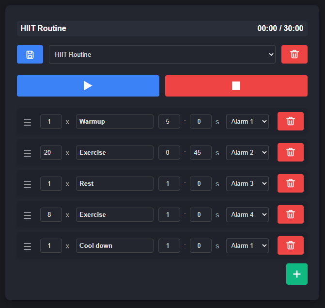
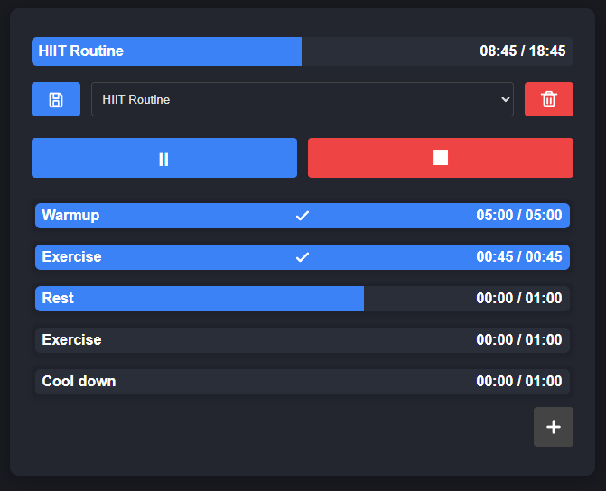

# Interval Timer

A lightweight, browser-based interval timer for building and running simple routines. Create named timers, choose a chime, drag to reorder, and run with clear progress bars for each timer and the overall routine. Routines save locally in your browser.

## Features
- Multiple timers: add, name, set duration (mm:ss), choose chime (10 included).
- Repeats per timer: set how many times a timer repeats (1–99). While running, the active row shows current/total (e.g., 2/5); hidden when repeats = 1.
- Drag-and-drop reorder with a handle for precise control.
- Play/pause, skip, and stop controls with clear icons.
- Progress bars: per-timer and overall routine with completion checkmarks.
- Local persistence: save routines to `localStorage`; auto-load last used routine.
- Accessible modals for Save and Delete with keyboard support (Enter/Escape).

## Quick Start
This is a static web app — no build step required.

Option 1: Open directly
- Open `index.html` in a modern browser.

Option 2: Serve locally (recommended)
- From the project folder, start any static server, for example:
  - Python 3: `python -m http.server 8080`
  - Node (serve): `npx serve .`
- Visit `http://localhost:8080` (or the port your server reports).

## Usage
- Add timer: click the “+” button.
- Edit: set repeats (x) before the name, set a name, minutes and seconds, and pick a chime.
- Reorder: drag using the ≡ handle on the left.
- Run: press ▶ to start; press ⏸ to pause; press ⏩ to skip the current timer; press ⏹ to stop and reset.
- Save: click the disk icon, name your routine, then Save.
- Load: use the dropdown to select a saved routine.
- Delete: select a routine and click the trash icon; confirm in the modal.

## Screenshots

Editor view

Running view

Notes
- Routines save in your browser’s `localStorage` under keys prefixed with `routine_`.
- The last used routine name is stored under `last_used_routine` and is auto-loaded.
- Sounds are in `sounds/Alarm01.wav` … `Alarm10.wav` and play at timer completion.
- Editing is disabled while a routine is running (for consistency and accuracy).
- Some browsers may throttle background tabs; keep the tab active for best timing.
- Existing saved routines without a repeats value default to 1.

## Project Structure
- `index.html` — App shell and UI containers.
- `styles/main.css` — All styles, including progress bars and layout.
- `src/` — JavaScript modules:
  - `state.js` — Central app state.
  - `runner.js` — Timer loop, play/pause/stop, chimes.
  - `timersList.js` — Editor and progress views; drag-and-drop.
  - `ui/topDisplay.js` — Overall routine progress/time formatting.
  - `dom.js` — Element wiring and modal/toast helpers.
  - `storage.js` — Save, load, list, delete via `localStorage`.
  - `main.js` — App initialization and event wiring.

## Development
- No build tooling required. Edit files and refresh the browser.
- Tested on modern Chromium/Firefox-based browsers.

### Dev-Only Speed Multiplier
- Purpose: accelerate time to capture in-progress screenshots/demos.
- Usage (no UI shown in the app):
  - URL param: append `?speed=10` to the page URL.
  - Or via DevTools: `localStorage.setItem('debug_speed', '10')` then refresh.
- Behavior: both the timer tick and smooth progress bars advance `speed` seconds per real second.
- Limits: capped at 200x to avoid runaway animations. Remove the param/key or set to `1` to return to normal.

## Contributing
Suggestions and improvements are welcome. Open an issue or PR with details.

## License
No license specified. If you intend to open source, add a `LICENSE` file and update this section.
